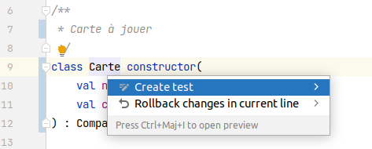
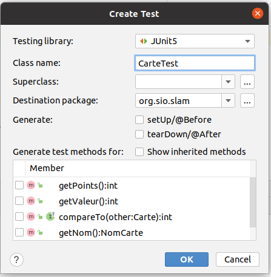
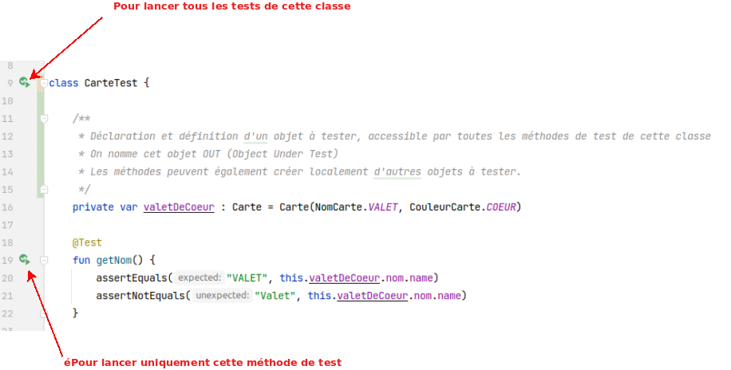
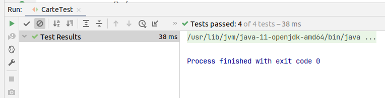
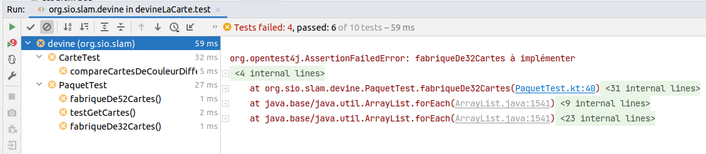

= DevineLaCarte
:author: Olivier Capuozzo
:docdate: 2022-07-19
:asciidoctor-version:1.1
:description: Projet pédagogique d'initiation à Kotlin
:icons: font
:listing-caption: Listing
:toc-title: Table des matières
:toc: left
:toclevels: 4

//:source-highlighter: coderay

== Thème

Développer une logique de jeu mettant en oeuvre de la conception objet et des tests unitaires.

Jeu en mode console. Un début d'implémentation est proposé (`MainPlayConsole.kt` en interaction en mode console/terminal)

=== Prérequis

Niveau : Deuxième année de BTS SIO SLAM

* Bases de la programmation,
* IntelliJ et kotlin opérationnels sur votre machine de dev
* Avoir fait des premiers pas avec Kotlin (exercices d'initiation)
* Avoir eu une première introduction à la notion de Test Unitaire, distinction entre *_expected value_* et *_actual value_*, dans une approche prédictive. En particulier avoir réalisé avec succès l'exercice https://ldv-melun.github.io/sio-slam/sio-component/exercice-premiers-pas-POO-TU-Kotlin.html[Faites vos comptes]

== Objectif

* Conception et mise au point d'une logique applicative avec Kotlin et JUnit

* Structure de données, recherche d'un élément dans une liste

* Analyse des actions du joueur (fonction du nombre de cartes, aides à la décision)

== Scénario typique d'une partie

1. (optionnel pour le joueur) paramétrage du jeu (par exemple choix du jeu de cartes, activation de l'aide à la recherche, ...)
2. Lancement d'une partie (le jeu instancie un jeu de carte et tire une carte "au hasard"), que le joueur doit deviner en un nombre de proposition de cartes *optimal*
3. Le joueur propose une carte
4. Si ce n'est pas la bonne carte, alors si l'aide est activée, le joeur est informé si la carte qu'il a soumise est plus petite ou plus grande que celle à deviner. Retour en 3.
+
Si c'est la bonne carte alors la partie se termine (passe à l'étape suivante). Le joueur peut choisir d'abandonner la partie.
5. Le jeu affiche des éléments d'analyse (nombre de fois où le joueur a soumis une carte, ses *qualités stratégiques*, ...)
6. Fin de la partie.

== Premiers éléments d'analyse

[plantuml]
----
class Jeu {
  avecAide : boolean
  ----
  demarre()
  isMatch(c : Carte) : boolean
  statistiquesDeLaPartie() : string
}

class Paquet {
  nom : String
  /cardinal : Int
  ---

}

class Carte {
  nom
  couleur
  /points : Int
  /valeur : Int
  ---
}

Jeu"*" -> "\ncarteADeviner  1  " Carte : "\t\t\t"
Jeu"*" -> " 1  " Paquet : "\t\t\t\t\t\t"
Paquet "    *    " --> "    * cartes  " Carte
hide circle
----

Cette analyse est une première ébauche, donc incomplète et à ajuster, mais suffisante pour réaliser vos premiers pas sur ce projet. Qu'est-ce qu'elle nous dit ?

* Une instance de `Jeu` est liée à une instance de `Paquet` (un jeu de cartes)  et à une instance de `Carte` nommée `carteADeviner` (la carte à deviner)
* Une instance de `Paquet` est liée à une collection de cartes nommée `cartes`.

Pour l'essentiel (le cours associé apportera d'autres informations et répondra à vos questions) :

* La classe `Jeu` est responsable de la logique du jeu.
* La classe `Paquet` définit la structure d'un jeu de cartes classique (de type jeu de 32 ou 52 cartes) et ses méthodes.
* La classe `Carte` définit la structure d'une carte à jouer et ses méthodes. Une carte à un "nom" (_VALET_, _HUIT_, ect.) associé à un nombre de _points_ (_DIX_ vaut 10 points par exemple), et une "couleur" parmi _TREFLE_, _PIQUE_, _CARREAU_, _COEUR_ ainsi qu'une relation d'ordre (entre carte à déterminer)

En résumé : Une instance de `Jeu` est reliée, à un instant _t_, à

* un paquet de cartes, lui-même relié à un ensemble de cartes  (`cartes`), et
* une instance de `Carte` (`carteADeviner` est la carte que le joueur doit deviner)

== Première implémentation

Une première implémentation di projet est proposée ici. C'est en effet le projet sur lequel vous êtes, vous lisez actuellement son README.adoc.

Ce chapitre vous présente quelques éléments de ce projet. Les challenges que vous permettront de vous y investir davantage.

Le jeu se base sur le jeu de cartes courant composé de 52 ou 32 cartes - voir link:https://fr.wikipedia.org/wiki/Jeu_de_cartes_fran%C3%A7ais[Jeu de cartes - wikipedia].

On simplifie le modèle en retenant comme propriétés d'une carte son *_nom_* (qui détermine son _nombre de points_) et sa *_couleur_* parmi _TREFLE, PIQUE, CARREAU_ et _COEUR_.

On admettra que la valeur d'une carte dépend de son nom. Par contre, une carte se compare à une autre par nom (ou valeur) et sa couleur (on définit ainsi une relation d'ordre totale sur cet ensemble, en définissant un rang hiérarchique entre les couleurs).

Le nom des cartes étant prédéfini, nous les implémentons sous la forme d'une *classe énumération*, par ordre croissant.

[source, kotlin]
----
package org.sio.slam.enum

/**
 * Noms des cartes, avec leur valeur de points
 */
enum class NomCarte(val points : Int) {
    DEUX(2),
    TROIS(3),
    QUATRE(4),
    CINQ(5),
    SIX(6),
    SEPT(7),
    HUIT(8),
    NEUF(9),
    DIX(10),
    VALET(11),
    DAME(12),
    ROI(13),
    AS(14)
}
----

[TIP]
====
En fait, chaque valeur de l'énumération est instance de la classe `NomCarte`.

Ainsi *SEPT* est une référence à une instance de `NomCarte`(`name = "SEPT"`, `points =  7`).
====

Pour la couleur, voici une première implémentation (qu'il faudra peut-être affiner)

[source, kotlin]
----
package org.sio.slam.enum

/**
 * Implémentation à minima
 */
enum class CouleurCarte {
    TREFLE, PIQUE, CARREAU, COEUR
}

----

IMPORTANT: En précisant le domaine de définition des valeurs de nom et de couleur d'une carte, nous renforçons la logique métier du code (*cohérence*), ainsi que la *robustesse* de l'application. En effet, une erreur de type sera détecté à la compilation et non lors de l'exécution (bug).

Nous pouvons maintenant définir la structure d'une carte.

.Classe `Carte` (Localisation : `src/main/kotlin/org.sio/slam/Carte.kt`)
[source, kotlin]
----
package org.sio.slam

import org.sio.slam.devine.enum.CouleurCarte
import org.sio.slam.devine.enum.NomCarte

/**
 * Carte à jouer
 */
class Carte constructor(
    val nom: NomCarte,   <1>
    val couleur: CouleurCarte <2>
    )  : Comparable<Carte> <3>
 {
    /**
     * La valeur d'une carte est déterminée par son nombre de points
     * (qui dépend des points associés à son nom dans la déclaration du
     * type énuméré NomCarte @see [org.sio.slam.enum.NomCarte])
     */
    val valeur: Int  <4>
        get() = this.nom.points  // DEUX => 2, TROIS => 3, ... , AS => 14

    /**
     * Les cartes se comparent en fonction de leur valeur ET de leur couleur
     * Si this et other ont même valeur et même couleur, alors nous avons à faire à 2 mêmes cartes
     * @see <a href="https://kotlinlang.org/api/latest/jvm/stdlib/kotlin/-comparable/compare-to.html">compareTo API</a>
     */
    override fun compareTo(other: Carte): Int {
       // TODO prendre aussi en compte la couleur
       // (en déterminant une hiérarchie entre couleurs)
       return this.valeur.compareTo(other.valeur) <5>
    }

}

----
<1> Les propriétés d'une carte (limités aux valeurs énumérées)
<2> idem
<3> La classe implémente l'interface `Comaparable` afin d'implémenter ue relation d'ordre entre les cartes (méthode `compareTo`). Cet aspect peut être ignoré dans un premier temps.
<4> __valeur__ est une *propriété dérivée* (nommage UML), également appelée *propriété calculée* (_computed property_)

<5> On s'appuie ici sur la méthode _compareTo_ définie par la classe _Int_

Dans la section suivante, nous allons nous intéresser à la classe de test `CarteTest`.

Cette classe existe déjà dans le projet initial. Elle est localisée dans la branche `test/` qui a une structure parallèle à `src/` (convention admise) - structurée en arborescence de dossiers, d'après le nom des packages.

TIP: La procédure de création des classes de tests a déjà été étudiée lors de https://ldv-melun.github.io/sio-slam/sio-component/exercice-premiers-pas-POO-TU-Kotlin.html[l'exercice préliminaire - Faites vos comptes].

////
Nous vous montrons ci-après une procédure pour la créer (ce type d'action vous sera demandé dans le dernier challenge).

.Curseur placé sur le nom de la classe, puis `ALT+ENTER`

.Choisir la version de JUnit (ceci peut entrainer un téléchargement)

////
=== CarteTest

Voici une première version de cette classe.

.Classe `CarteTest` (Localisation : `test/main/kotlin/org.sio/slam/CarteTest.kt`)
[source, kotlin]
----
package org.sio.slam

import org.junit.jupiter.api.Test

import org.junit.jupiter.api.Assertions.*
import org.sio.slam.enum.CouleurCarte
import org.sio.slam.enum.NomCarte

class CarteTest {

    /**
     * Déclaration et définition d'un objet à tester,
     * accessible par toutes les méthodes de test de cette classe
     * On nomme cet objet OUT (Object Under Test)
     * Les méthodes peuvent également créer localelement d'autres objets à tester.
     */
    private var valetDeCoeur : Carte = Carte(NomCarte.VALET, CouleurCarte.COEUR)

    @Test
    fun getNom() {
        assertEquals("VALET", this.valetDeCoeur.nom.name)
        assertNotEquals("Valet", this.valetDeCoeur.nom.name)
    }

    @Test
    fun getCouleur() {
        // test sur le nom (String)
        assertEquals("COEUR", this.valetDeCoeur.couleur.name)

        // test sur la valeur énumérée
        assertEquals(CouleurCarte.COEUR, this.valetDeCoeur.couleur)

        // test sur mauvaise valeur énumérée
        assertNotEquals(CouleurCarte.PIQUE, this.valetDeCoeur.couleur)
    }

     @Test
     fun valeurCartes() {
         assertEquals(11, this.valetDeCoeur.valeur)

         val asDeCoeur : Carte = Carte(NomCarte.AS, CouleurCarte.COEUR)
         val roiDeCoeur : Carte = Carte(NomCarte.ROI, CouleurCarte.COEUR)
         val troisDePique : Carte = Carte(NomCarte.TROIS, CouleurCarte.PIQUE)

         assertEquals(14, asDeCoeur.valeur)
         assertEquals(13, roiDeCoeur.valeur)
         assertEquals(3, troisDePique.valeur)

         assertNotEquals(asDeCoeur.valeur,roiDeCoeur.valeur)
     }

    @Test
     fun compareCartesDeMemeCouleurMaisDeValeurDifferente()  {
         val asDeCoeur : Carte = Carte(NomCarte.AS, CouleurCarte.COEUR)
         val roiDeCoeur : Carte = Carte(NomCarte.ROI, CouleurCarte.COEUR)

         // test avec compareTo
         assertTrue(asDeCoeur.compareTo(roiDeCoeur) > 0 )

         // Finalement, si les objets sont *comparables*
         // alors les opérateurs binaires de comparaisons sont applicables
         // L'opérateur '>' appellera automatiquement la méthode compareTo (comme ci-dessus)
         // voir https://kotlinlang.org/docs/collection-ordering.html" - ordre naturel
         assertTrue(asDeCoeur > roiDeCoeur)
     }
 }

----

=== Une procédure pour exécuter les tests unitaires

==== Préparer votre IDE
Les IDE en général intègrent une interface utilisateur permettant au développeur de lancer l'exécution des tests unitaires. Il ne faut pas s'en priver !

Vérifier que vous avez activé l'exécution des tests à partir d'IntelliJ IDEA. Pour se faire, vérifier la valeur `Run Tests using` qui doit être *_IntelliJ IDEA_* :

1. `File > Settings (CTRL+ALT+S)`
2. `Build, Execution, Deployment > Build Tools > gradle`
3. `Run Tests using: *IntelliJ IDEA*`

==== Lancement des tests unitaires
Il existe plusieurs façons de lancer l'exécution des tests unitaires, par le menu `Clic droit` sur le nom de la classe, Raccourci d'exécution, `Clic sur la barre verticale` en face de la ligne de déclaration de classe ou de la méthode. C'est cette dernière méthode qui est illustrée ci-dessous.

.Exemple d'une exécution sans erreur

'''
'''

== Challenge-1 : Prise en main et tests unitaires

Temps estimé : de 3h à 6h

=== Vérifier les prérequis de votre système

* Vérifier que vous avez `git` opérationnel sur votre système. Pour cela, ouvrir un terminal et lancer la command : `git --version`
+
.Exemple dans un terminal (sous windows lancer `cmd` pour ouvrir un terminal)
[code, bash]
----
$ git --version
git version 2.25.1
----

* Vérifier que l'IDE IntelliJ IDA est opérationnel.
+
TIP: Votre établissement bénéficie de licences éducatives gratuites pour les étudiants. Demander un lien d'activation.

=== Prise en main du projet de démarrage

Cloner le projet support dans une répertoire de travail.
Cette opération peut se réaliser en ligne de commande. Par exemple.

[code, bash]
----
mkdir devinelacarte
cd devinelacarte
clone https://gitlab.com/sio-labo/devinelacarte.git
----

ou via `IDEA`  : `File > New > Project from Version Control`

Finalement ouvrir le projet avec `IDEA` (choisir le dossier racine `devinelacarte`)

=== Lancer les tests unitaires

Dans l'arborescence `test`, clic droit sur le package `org.sio.slam.devine` puis `Run Tests in org.sio.slam.devine`

On peut lire que 4 tests unitaires sur 6 ne sont pas passés. Ce sont :

* `fabriqueDe52Cartes()`
* `fabriqueDe32Cartes()`
* `testGetCartes()`
* `compareCartesDeCouleurDifferenteMaisDeMemeValeur()`

=== Faire passer les tests unitaires

Votre travail consiste à implémenter ces tests (la branche `test/`), en *définir la logique*, et mettre au point, *conjointement*, les méthodes testées dans la branche `src/`.

[IMPORTANT]
====
L'approche par les tests permet de faire évoluer les méthodes métier (branche `src/`) en fonction des besoins, comme par exemple la méthode qui construit un jeu de 54 cartes.
====

'''
== Challenge-2 : Jouer avec le jeu

Temps estimé : de 3h à 6h

Lancer le jeu (il s'exécute en mode console-terminal) : Clic droit sur `MainPlayConsole` puis `Run MainPlayConsole`. Attendre que la compilation opère, puis aller dans le terminal pour passer en mode interaction. Jouer et relancer le jeu pour tester plusieurs valeurs de cartes.

=== Représentation de l'algorithme initial de la fonction `main`

*Sans rentrer dans le détail des instructions*, représenter l'idée de l'algorithme implémenté par la fonction `main`.

Cet algorithme sera représenté sous la forme d'un *diagramme d'activité* rédigé en `plantuml`. Vous trouverez ci-dessous un exemple pour démarrer qui utilise la version beta de plantuml (juillet 2022 - nouvelle syntaxe : https://plantuml.com/fr/activity-diagram-beta[plantuml activity diagram beta] )

:figure-caption: Algorithme
.Exemple d'expression d'un algorithme en UML
[plantuml]
----
@startuml
start
:demander quel jeu de cartes
demander si activation aide assistance
intialisation du jeu;
:demander nom de carte
demander couleur de carte;
if ( ?) equals (ok) then
 :action;
else
  : ? ;
endif
:autre action;
stop
@enduml
----

Voici le code source de ce diagramme (consultable également dans le source de ce README)

.source plantuml
[source, asciidoc]
----
[plantuml]
-----
@startuml
start
:demander quel jeu de cartes
demander si activation aide assistance
intialisatio-n du jeu;
:demander nom de carte
demander couleur de carte;
if ( ?) equals (ok) then
  :action;
else
  : ? ;
endif
:autre action;
stop
@enduml
-----
----

=== Implémenter les TODOs (A)

Vous les trouverez dans la définition de la classe `MainPlayConsole`

=== Représentation algorithme de la fonction `main` nouvelle version

Représenter, sous la forme d'un diagramme d'activité rédigé en `plantuml`, la nouvelle version de l'algorithme de la fonction `main`.

'''

== Challenge-3 : Rebattre les cartes

Temps estimé : de 2h à 3h

À ce niveau là, vous avez acquis une certaine autonomie sur le projet et intégré les concepts de base de la notion de tests unitaires. C'est ce que nous allons vérifier.

Ajouter une méthode à `Paquet` qui bat les cartes détenues par une instance de cette classe. Bien entendu, on prendra soin de concevoir plusieurs méthodes de test unitaire qui vérifient à la fois un bon fonctionnement dans les cas attendus, mais aussi sa logique et robustesse dans les cas aux limites.

[CAUTION]
====
On attend une nouvelle méthode d'instance dans

`devineLaCarte.*src*.org.sio.slam.devine.core.Paquet`

et *plusieurs* méthodes de test dans

`devineLaCarte.*test*.org.sio.slam.devine.core.PaquetTest`
====

'''

== Challenge-4 : La stratégie du joueur

Temps estimé : de 4h à 8h

Votre travail consiste à *concevoir une classe de tests de la logique du jeu* (représentée par la classe `Jeu`).

La classe `MainPlayConsole` est un test manuel. Ce que nous vous demandons est d'automatiser plusieurs scénarios de tests unitaire pour l'objet `Jeu`.

Ce travail est à réaliser en binôme. Il y aura également des décisions à prendre, qui pourront être discutées collectivement, entre différents binômes.

Voici quelques éléments à prendre en compte dans votre analyse.

* *Recherche linéaire* (dite aussi séquentielle) : L'utilisateur explore une à une les cartes afin de trouver la bonne.
Dans le pire cas il soumettra autant de cartes que le jeu en contient (l'ordre de grandeur est O(n), _n_ étant
le nombre de cartes), dans le meilleur cas O(1) (coup de chance il tombe dessus du premier coup).
* *Recherche dichotomique* (nécessite une relation d'ordre total) : Si l'utilisateur est informé de la position de
la carte qu'il soumet par rapport à la carte à trouver (inférieur ou supérieur) alors il peut appliquer une
stratégie qui réduit le nombre de cas à soumettre dans le pire cas, de l'ordre de O(log2 n). Wikipédia vous fournira
des informations utiles sur ces notions.
+
NOTE: Pour information seulement (sans application dans ce projet), vérifier si Kotlin n'aurait pas, parmi ses fonctions de base, une fonction de recherche dichotomique.

L'analyse de la stratégie du joueur, qui se déclenche au moment où le joueur termine sa partie, devra s'appuyer, *entre autres*, sur les paramètres de la partie, à savoir le *nombre de cartes* et si l'*aide à la décision a été activée ou non* pour la partie en question.

Le résultat de l'analyse de la stratégie du joueur peut être représentée sous la forme d'un texte (une chaine de caractères) ou d'un type énuméré, ou les deux... C'est à vous de décider.

== Livraison

Modalité de livraison (mode « binôme ») :

* Dépôt de votre projet sur GitLab avec un *READMEprof.adoc* ou Github avec un *README.md*. Ce document présentera le travail que vous avez réalisé (Challenge 1 à 4), ce sera votre *rapport de projet*. Il inclura un lien vers le dépôt initial _DevineLaCarte_ (celui-ci) et un vers votre propre dépôt.
* Livraison par mail d'une version *pdf* de votre README au plus tard #*lundi 09 octobre 2022 23h59*#.

Ressources utiles :

* Gitlab et AsciiDoc: https://docs.gitlab.com/ee/user/asciidoc.html[courte documentation asciidoc sur GitLab]
* Github et MarkDown https://guides.github.com/features/mastering-markdown/

TIP: sous IDEA, vous pouvez extraire une version *PDF* de votre REAMDE.adoc (fonction dans la barre de menu d'édition du .adoc).

TIP: Pour le travail en binôme, sous IDEA, voir le concept (et outil) _code with me_

NOTE: n'hésitez pas à consulter le code source de ce README.adoc.

== Évaluations

2 évaluations :

.Evaluation
|===
|Forme |Critères | Qui ? | Coefficient

|Projet (README livré)
a|

* Capacité à livrer dans les temps,
* Couverture du travail réalisé
* Qualité du travail
|Team (même note pour tous les membres d'une équipe)
| 1

|Évaluation sur table (écrit : 2h - sans machine)
a|

* Niveau de compréhension des concepts mis en oeuvre dans le projet
* Compréhension de code
* Logique de programmation (écrit)

|Individuel
|2

|===

Bonne analyse et programmation !
